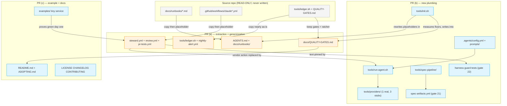

# Plan: Autonomous-Agent SDLC Template Repository

## Architecture

The template is four layers, and the layering is what makes it provider-agnostic and
stack-agnostic at the same time:

1. **Contract layer (docs).** `AGENTS.md` + `docs/runbooks/*` + `docs/QUALITY-GATES.md`.
   Stack-neutral and vendor-neutral prose. This is where almost all the extracted value
   lives, because the incident lessons are written as rules, not as code.
2. **Config layer.** A single `.agents/config.yml`: provider name, model id per ROLE
   (`judge` / `execute` / `challenge`), auth mode per provider, mention trigger, alert
   channel. Plus `.agents/prompts/<agent>.md` as plain reviewable markdown.
3. **Adapter layer.** `tools/run-agent.sh` reads the config, resolves the prompt, shells
   out to `tools/providers/<name>.sh`. Every workflow calls `run-agent.sh` — never a
   vendor action directly. This is the seam that makes the whole thing portable, and it
   is entirely new code (nothing to extract).
4. **Enforcement layer (workflows).** The extracted `.github/workflows/*` with all
   project specifics replaced by `{{PLACEHOLDER}}`s and vendor calls replaced by
   `run-agent.sh`, plus the reference-stack gate instantiation.

Cross-cutting: `tools/spec-pipeline/` is the provider-neutral fallback that creates the
same spec directory + gate ledger from templates when the Claude-Code-only build plugin
is not present. The contract is the ARTIFACTS, not the plugin — which is exactly what
makes gate 21 checkable regardless of provider.

### The extraction inventory (surveyed, not guessed)

Every file below was opened during planning. Source root: `{{SOURCE_REPO}}`
(READ-ONLY). Bucket A = copy nearly as-is; B = copy then placeholder; C = write new.

| # | Source path | Size | Bucket | What it encodes / what changes |
|---|---|---|---|---|
| 1 | `docs/runbooks/agent-ledgers.md` | 144 L / 8.4 KB | **A** | Ledger schema: required `date`/`verdict`/`summary`/`issues`/`ping`, optional `metrics`/`pending`/`handoff`; history-not-instruction split; narratives never read back. **0 brand hits** — ports almost verbatim. |
| 2 | `docs/runbooks/agent-escalation.md` | 49 L / 6.1 KB | **A** | S0–S3 ladder, channels, "rule zero: escalate one level up", anti-spam rules. 2 brand hits + alert-channel specifics → `{{ALERT_CHANNEL}}`. |
| 3 | `.github/steward-temper-headless.md` | 168 L / 10.9 KB | **A** | The headless contract: never ask, verify the premise first, never override a failed gate, park with a report, back up operator state. **0 brand hits.** Pipeline names → `{{BUILD_PIPELINE}}`; the dated false-premise incident table → neutral lesson. Lands as `.github/agent-temper-headless.md`. |
| 4 | `.github/pull_request_template.md` | 53 L / 2.5 KB | **A** | What/why, behaviour change, evidence checkboxes, the two **gate-integrity attestations**, risk & rollback. **0 brand hits.** Only 3 stack command checkboxes change. |
| 5 | `.github/workflows/nightly-alert.yml` | 198 L / 8.9 KB | **A** | The reusable notifier: `workflow_call` with `gate`/`severity`/`what_red_means`/`runbook`; opens-or-updates the `[nightly] … is failing` issue + alert ping; job-level `permissions: {contents: read, issues: write}`. Alert channel → `{{ALERT_CHANNEL}}` adapter. |
| 6 | `tools/ledger.sh` | 154 L / 6.3 KB | **A** | append/read/latest/trend against an orphan `agent-ledger` branch; throwaway clone of the REMOTE (cloning the local checkout makes the push land on a local ref and report success while nothing reaches GitHub); 5-attempt fetch-append-replay, never force. 1 brand hit: the commit identity `<project>-agent@<project>.local`. `AGENTS` list becomes config-driven. |
| 7 | `docs/runbooks/agent-communication-style.md` | 118 L / 4.9 KB | **A** | Plain-language rule + "technical detail moves BELOW the plain summary, it is not deleted". Essentially 100% generic; 1 brand hit. |
| 8 | `docs/runbooks/multi-model-review.md` | 162 L / 7.4 KB | **A→B** | Why the adversary must be a different model FAMILY, why it never decides, graceful degradation when its key is absent. **0 brand hits**; vendor names → `challenge` role. |
| 9 | `AGENTS.md` | 37 L / 6.5 KB | **B** | The seven guardrails + session-start checklist + "where things live". Short and dense; every guardrail transfers as a shape. Models → role placeholders; pipeline → `{{BUILD_PIPELINE}}`. |
| 10 | `docs/QUALITY-GATES.md` | 246 L / 17.3 KB | **B** | 20-gate inventory with tool + config location + floor; **the ratchet policy** (7 bullets, incl. "suppression is not passing" and the two honest reasons a number may drop); the 10-item "what each layer is FOR" ladder; required-check-vs-`paths:`-filter rule; the notifier-shipped-broken postmortem. Keep every gate + policy; floors and tool names become the adopter's. **Add gates 21 and 22.** |
| 11 | `docs/runbooks/agent-routines.md` | 672 L / 91.6 KB | **B** | 8 agents with schedules, inline prompt blockquotes, 7 binding efficiency rules, DST reasoning, watcher-ring, fix verification, model policy. The preamble + efficiency rules + kill switch generalize cleanly; ~15 PromQL metric names and ~40 issue numbers do not → `{{HEALTH_SIGNAL}}` slots. Largest single genericization job. |
| 12 | `docs/runbooks/agent-modes.md` | 237 L / 16.6 KB | **B** | The ONLY steering channel: `FULL`/`REPORT-ONLY`/`ACTIVE` modes, per-run PR caps, expiring exception table, mode history, standing decisions. **0 brand hits** — mechanism ports whole; numerics are examples. |
| 13 | `docs/runbooks/agent-operator-guide.md` | 60 L / 6.1 KB | **B** | Where to look in urgency order, the ~10 min/week routine, how to steer, how to pause, the safety model, glossary. 1 brand hit + GitHub issue URLs. |
| 14 | `docs/runbooks/branch-protection.md` | 125 L / 5.4 KB | **B** | Which checks to require and why; **context string = job `name:` or id**; a required check that never reports blocks forever; job-level `if:` counts as passing, workflow-level `paths:` does not; nightlies must never be required; agents cannot self-grant. |
| 15 | `docs/runbooks/qa-procedures.md` | 167 L / 9.1 KB | **B** | How to read a red gate; hung-`in_progress` triage; the mutually-exclusive `gh run rerun` forms and the databaseId-vs-URL-number 404 trap; what is never an acceptable fix. |
| 16 | `.github/workflows/claude.yml` | 455 L / 25.7 KB | **B** | → `steward.yml`. Auto-triage on `issues:[opened]` with no tag; every other trigger needs the mention **and** `sender.type != 'Bot'`; **job-level** concurrency `…-${{ issue.number \|\| pull_request.number }}` so a skipped job never enters the group; the visible-outcome check (paginated comment scan since job start + real pushed branch, else marker comment + `setFailed`); the eviction reporter. Vendor action → `run-agent.sh`; mention phrase → `vars.AGENT_MENTION \|\| '@agent'`. |
| 17 | `.github/workflows/claude-review.yml` | 605 L / 38.4 KB | **B** | → `review.yml`. Two reviewers + referee, chained by `needs:`; per-PR concurrency; reviewer B gated on its key with `::warning::` degradation; the **`<!-- reviewer: … -->` first-line marker**; referee collects with `--paginate --slurp` then filters (the per-page-filter bug, commented in situ); reads BOTH comment endpoints; handoff FILES AN ISSUE (bot-sender gate makes commenting impossible) and says loudly when the PAT is absent; never triggers on `synchronize`. The single densest incident file. |
| 18 | `.github/workflows/pr-tests.yml` | 235 L / 10.3 KB | **B** | The blocking gauntlet: `changes` (paths-filter) → `unit-tests` → `integration-tests`, each job **and** each step carrying the same `if:` — this IS the clean-skip pattern SC3 requires. Implements gates 1,2,3,4,6,7,8,9,12,13,14,19. |
| 19 | `.github/workflows/pr-mutation.yml` | 264 L / 13.1 KB | **B** | Gate 17 diff-scoped mutation + a scope-computation self-test (already a harness-guard-shaped test). |
| 20 | `.github/workflows/pr-validation.yml` | 93 L / 3.7 KB | **B** | Gate 10 migration validation: duplicate versions + fresh-DB apply. Hard-coded DB name + password → placeholders. Note its workflow-level `paths:` filter — safe here ONLY because it is documented as not-required. |
| 21 | `.github/workflows/secret-scan.yml` | 44 L / 1.3 KB | **B** | Gate 11. Job `name:` is a required-check context string — preserve the name/context relationship. |
| 22 | `.github/workflows/mutation-tests.yml` | 142 L / 6.1 KB | **B** | Gate 5 nightly, both stacks, `notify-failure` ORs both job results. |
| 23 | `.github/workflows/e2e-tests.yml` | 124 L / 5.6 KB | **B** | Gate 15 e2e + axe, **KNOWN_VIOLATIONS baseline empty**. |
| 24 | `.github/workflows/flaky-test-detection.yml` | 106 L / 4.9 KB | **B** | Gate 20: run 3×, diff per-test outcomes. |
| 25 | `.github/workflows/security-scan.yml` | 229 L / 11.1 KB | **B** | Gate 16 deep dep scan (`failBuildOnCVSS=8`) + re-run of 12. |
| 26 | `.github/workflows/live-api-contract-tests.yml` | 121 L / 6.1 KB | **B** | Gate 18, informative/non-blocking. Fully domain-specific body → becomes a documented shell. |
| 27 | `.github/workflows/ci-health-watch.yml` | 146 L / 7.1 KB | **B (optional)** | Runner-liveness + minutes watchdog; deliberately NOT self-hosted so it survives the thing it watches. Good template value; runs on the hosted runner. |
| 28 | `docs/runbooks/agent-access-setup.md` | 64 L / 8.1 KB | **B→C** | Highest brand density of all (7 hits in 64 lines). Keep only the SHAPE — network allowlist → read-only observability token → agent secrets → VCS access → HTTPS-only/no-SSH/no-DB access pattern → dry-run before scheduling. |
| 29 | `.github/workflows/deploy.yml` | 282 L / 15.5 KB | **C (harvest only)** | Not extracted. Harvest one idea: the deploy-time gate — restore latest backup into a scratch container and validate migrations before restarting. |
| 30 | `.github/workflows/growth-agent.yml`, `prod-env-check.yml` | 63 + 52 L | **skip** | Domain-specific. Not extracted. |

**Written new (bucket C, nothing to extract):** `.agents/config.yml`,
`.agents/prompts/*.md` (5), `tools/run-agent.sh`, `tools/providers/*.sh` (4),
`tools/spec-pipeline/`, `tools/init.sh`, `tools/check-deidentified.sh`,
`.github/workflows/agents-scheduled.yml`, `.github/workflows/spec-artifacts.yml`
(gate 21), the gate-22 harness guard tests, `examples/`, `README.md`, `ADOPTING.md`,
`LICENSE`, `CHANGELOG.md`, `CONTRIBUTING.md`, `CLAUDE.md`/`GEMINI.md`/
`.github/copilot-instructions.md` pointer files, `docs/runbooks/qa-procedures.md`
additions.

### What CANNOT be extracted — and therefore becomes a documented setup step

Three things exist outside the source repository's tree and no amount of copying will
produce them. Faking them would be worse than omitting them, because a simulated
schedule or a committed "branch protection config" reads as done while nothing is
enforced.

1. **Routine schedules.** In the source system the scheduled agents fire from the
   vendor's own scheduler, which stores its crons server-side. Nothing in the repo
   encodes them. → The template ships `.github/workflows/agents-scheduled.yml` (a cron
   matrix over agent names, each calling `run-agent.sh`) as the portable replacement,
   **disabled by default**, and the README notes that a vendor scheduler can replace this
   workflow one-for-one because the prompts reference only repo files.
2. **Branch protection.** A repository admin setting, reachable only through the UI or
   the API. It is what makes every gate binding rather than advisory, and it is
   deliberately the LAST setup step. → `docs/runbooks/branch-protection.md` (extracted)
   carries both the UI path and the single API call, plus the exact context strings that
   are safe to mark required. README points there.
3. **Secrets, the app install, and the ledger orphan branch.** None can be committed.
   `init.sh` prints them as the remaining manual work in the correct order.

### Third-party facts deliberately NOT invented

The source repo verifies exactly TWO execution paths in production, and they are the two
that ship working:

1. **Claude Code**, via the vendor action — flags verified by months of production use.
2. **The compatible-endpoint path** — overriding base URL and auth token in a subprocess
   with the original credentials unset — verified in `multi-model-review.md` and
   `claude-review.yml`, where it is how the source's second reviewer actually runs.

Only **Codex and Gemini CLI** are stubs, carrying the exact command shape plus a docs link.

An earlier draft of this plan listed compatible-endpoint among the stubs while
simultaneously describing its mechanic as verified and extracted. That was a
misclassification with real consequences, because compatible-endpoint is the ONLY delivery
path for the `challenge` role. As a stub it would have meant reviewer B never runs for
anyone, SC10's graceful-degradation branch becomes the only branch ever exercised (so
"degraded to one opinion" is the permanent normal state rather than a failure signal), and
the `challenger` scheduled agent has no execution path at all — reducing the
different-family adversarial review, which is a large share of why this template's output
can be trusted, to documentation about a capability nobody can enable. It holds the same
evidence as `claude-code.sh` and gets the same classification.

## Approach Decisions

### Decision 1: Extract-and-genericize the workflows rather than regenerate them from the prompt
- **Chosen:** Copy `claude.yml` (455 L) and `claude-review.yml` (605 L) verbatim, then
  substitute placeholders and swap the vendor action for `run-agent.sh` — preserving
  every incident comment in place, rewritten as a neutral lesson.
- **Alternative — write fresh workflows from the prompt's requirement list:**
  - **Pros:** Far less genericization work; the result is clean, short, and free of the
    source's accumulated exceptions; no risk of leaking a project noun.
  - **Cons:** The prompt's "non-obvious requirements" section is a *summary* of these two
    files, not a specification of them. It names ~11 lessons; the files encode more —
    the eviction reporter, the `--comment` flag that lost 22 reviews, the exact-literal
    dedupe that deliberately avoids `--search in:title`, the unrecognised-review-format
    escalation, the workflow-file supply-chain carve-out.
  - **Why not chosen:** A regenerated workflow would omit those and still look correct
    and still go green — which is the precise failure mode ("a broken collector produces
    green runs and wrong answers") the template exists to prevent. The extra
    de-identification cost is bounded and mechanically checkable by SC1; the cost of a
    silently-missing lesson is not detectable at all.

### Decision 2: One entrypoint script (`run-agent.sh`) rather than per-provider workflows
- **Chosen:** Every workflow calls `tools/run-agent.sh <agent>`; provider differences
  live in `tools/providers/<name>.sh`.
- **Alternative — a matrix of provider-specific workflow files, or a composite action per provider:**
  - **Pros:** Native GitHub idiom; each provider's action gets its documented inputs used
    directly; no shell indirection.
  - **Cons:** The provider choice would then live in workflow YAML, so switching provider
    means editing every workflow — and the same switch would have to be repeated in the
    scheduled-agent matrix, the steward and the review workflow.
  - **Why not chosen:** It breaks the stated hard requirement — "editing one config
    file". It also makes `--dry-run` impossible to implement uniformly, and `--dry-run`
    is the explicitly-requested smoke test (SC4).

### Decision 3: Classify each adapter by the evidence behind it — two working, two stubs
- **Chosen:** Claude Code AND compatible-endpoint ship fully working; both are verified by
  the source repo's production use. Codex and Gemini CLI print an `UNVERIFIED STUB` banner,
  the exact command shape, and a docs URL, then exit non-zero when actually run.
  The rule is evidentiary, not numeric: an adapter ships working if and only if the source
  demonstrates its invocation. Shipping compatible-endpoint as a stub while holding evidence
  for it would have silently disabled the `challenge` role for every adopter.
- **Alternative — write plausible invocations for all four from memory/model knowledge:**
  - **Pros:** The template looks complete; an adopter on Codex gets something that runs.
  - **Cons:** An invocation with a wrong headless flag typically *succeeds* at the shell
    level and does nothing useful — the agent never reads the prompt, the run goes green,
    and the ledger records a healthy run.
  - **Why not chosen:** That is the same class of failure as the broken collector, and it
    is worse here because it is in the adopter's copy where upstream can never fix it.
    The prompt makes this call explicitly; a stub a maintainer fills in beats a plausible
    invocation that silently does nothing.

### Decision 4: Mirror the source's stack as the reference stack
- **Chosen:** Java/Spring Boot (Maven, Flyway) + React/TypeScript.
- **Alternative — a lighter reference stack (Node-only, or Python) so the example is smaller:**
  - **Pros:** A ~200-line example is far easier to write; CI is faster; fewer toolchain
    prerequisites for a casual adopter.
  - **Cons:** Every one of the 12 blocking-gate configurations (JaCoCo ratchet, ArchUnit
    freeze store, PIT diff-scoped mutation, Cucumber acceptance specs, Flyway validation,
    maven-enforcer hygiene) would have to be re-authored against a different toolchain —
    i.e. regenerated, with no tested artifact behind them.
  - **Why not chosen:** It converts ~12 extracted, production-proven gate configs into
    ~12 fresh guesses, which contradicts the binding "extract, don't regenerate"
    constraint. Stack size is a one-time cost paid by the template author; an unproven
    gate config is a permanent cost paid by every adopter.

### Decision 5: Gate 21 as a standalone workflow, not a step inside `pr-tests.yml`
- **Chosen:** A separate `.github/workflows/spec-artifacts.yml` producing its own status
  check context.
- **Alternative — add a step to the existing `pr-tests.yml` unit-tests job:**
  - **Pros:** One fewer workflow file; no extra checkout; reuses the existing `changes`
    job output.
  - **Cons:** `pr-tests.yml`'s jobs are gated on `needs.changes.outputs.backend/frontend`.
    A docs-only or spec-only PR skips those jobs — so the spec-artifacts check would skip
    exactly on the PRs where the process discipline matters most, and a required check
    that skips reports "passing".
  - **Why not chosen:** It would make gate 21 unenforceable on the class of PR it targets,
    reducing it to the convention it was created to replace.

### Decision 6: Write the gate-22 pin list BEFORE substitution, not after it
- **Chosen:** A new Task 6b produces `tests/harness-guards/pins.json` + a human-readable
  `lesson-inventory.md` by reading the SOURCE workflows, before any of them is genericized.
  Tasks 7–10 are then judged against a pin list that already exists, and Task 10b
  reconciles every bucket-B file line-by-line (`kept + placeholdered + deleted`, every
  deletion justified) while the source is still reachable. Task 20 executes that list
  instead of authoring it.
- **Alternative — the original ordering: genericize in PR (a), then write the guards in PR (b)
  by reading the extracted files:**
  - **Pros:** One less artifact; the guards are written against the exact text that shipped,
    so they cannot be trivially wrong; no need to hold the source open across two PRs.
  - **Cons:** The guards would pin whatever *survived* substitution. If the `--paginate
    --slurp` line, the bot-sender gate or the supply-chain carve-out were dropped during
    PR (a), the PR (b) guard would pin the post-loss state and go green permanently. The
    net would be woven after the fall — it catches future regression but structurally
    cannot catch the extraction loss that justified it. The checksum manifest does not help:
    it proves we did not WRITE to the source, not that we took everything out of it.
  - **Why not chosen:** Silent omission is risk #1 in this plan and gate 22 was named as
    its only mitigation. A mitigation that cannot detect the failure it was created for is
    worse than none, because it is *credited* in the risk register. This also surfaces a
    distinction the original ordering hid: some lessons are `semantic-manual` — the string
    itself must change during genericization, so no literal pin is possible. Those need a
    hand-walked checklist, and the inventory must say which is which, or an unpinnable
    lesson gets mistaken for a pinned one.

### Decision 7: Floors ship uncalibrated; measuring is a separate, explicitly-online step
- **Chosen:** `init.sh` writes every floor as an `unset` SENTINEL and makes no measurement.
  A new `tools/measure-floors.sh` — explicitly online, explicitly slow — is run by the
  adopter against their OWN product and is the step that arms the ratchet. It refuses to
  run while `examples/` is still present. Until it runs, every ratchet gate passes while
  printing `floor not yet calibrated`.
- **Alternatives — (i) init.sh measures, as originally specified; (ii) ship all floors at `0`:**
  - **Pros (i):** One script, one step; the adopter is armed immediately and never forgets.
    **Pros (ii):** Simplest possible rule; no sentinel state; nothing new to build.
  - **Cons (i):** It cannot be built as specified. SC7 requires `init.sh` to make no network
    calls; measuring on the reference stack requires `mvn test` and `npm ci`, and a mutation
    baseline requires PIT and Stryker. Worse, the only thing available to measure at init
    time is the example — which `init.sh` offers to delete in the same run. Floors
    calibrated to a toy service (trivially ~95% covered) and then applied to a real product
    reproduce exactly the permanent-red failure the day-one requirement exists to prevent.
    **Cons (ii):** A floor of `0` is indistinguishable in a config file from a gate someone
    switched off. The adopter gets a gauntlet that is silently unarmed and no signal that it
    is — which is the "green run, wrong answer" shape this whole template opposes.
  - **Why not chosen:** Day-one green must come from floors being *uncalibrated*, not from
    floors being *low*, and the difference has to be visible on every run until it is fixed.
    The sentinel is what makes the unarmed state loud; the refuse-while-example-present
    check is what stops the easy path (run it right after init) from quietly calibrating to
    the example anyway. The source product's real numbers still ship — as a labelled worked
    example in `QUALITY-GATES.md`, never as a default.

### Decision 8: An unverified adapter disables the agent workflows, not the gauntlet
- **Chosen:** Each adapter declares `ADAPTER_STATUS=verified|unverified` as one greppable
  line. `init.sh` reads it: on `unverified`, `steward.yml` and `review.yml` ship disabled
  alongside the routines, with a printed explanation naming the adapter file, its docs URL,
  and the re-run-init enable path. The 22 gates stay live on every provider.
- **Alternatives — (i) let the stub fail loudly on first use, as originally planned;
  (ii) narrow the claim: name Claude Code in SC12 and add a status column to the README:**
  - **Pros (i):** No new logic; the failure is loud, which is the house style. **Pros (ii):**
    Honest and nearly free; the adopter is forewarned rather than surprised.
  - **Cons (i):** The quickstart's first instruction is "open issue #1". On the two stub
    providers that goes red immediately, on the one path the whole adoption story is built
    around, and SC12 claims otherwise without naming a provider. **Cons (ii):** It corrects
    the documentation and leaves the wall in place — a forewarned adopter still cannot get
    a green first PR without finishing an adapter first, which inverts the intended order
    (see the loop work, then invest in it).
  - **Why not chosen:** The stub's non-zero exit is right and stays. What was wrong is
    *reaching* it: shipping a live workflow that can only call an adapter known not to work.
    Disabling is the honest branch and it costs the adopter nothing real, because no gate
    invokes an agent CLI — the gauntlet, which is most of the template's value, is fully
    live on day one for every provider. Declaring status inside the adapter rather than in
    an init.sh lookup keeps one source of truth; a second list drifts the moment someone
    finishes an adapter.

### Decision 9: The de-identification term list never enters the tree, and the sweep has a list-free companion
- **Chosen:** `tools/check-deidentified.sh` ships generic — it takes `--terms <file>` and
  contains no project-specific string. The real terms live in
  `.temper/evidence/deident-terms.txt`, gitignored, build-time only. The scanner is subject
  to its own sweep with NO self-exclusion. A separate list-free reviewer pass (Task 12b)
  records a verdict per extracted file.
- **Alternatives — (i) the original: terms inline in the shipped scanner;
  (ii) don't ship the scanner at all:**
  - **Pros (i):** Zero-configuration for the adopter; one file; the check is self-contained.
    **Pros (ii):** Nothing can leak, and the tool is genuinely build-time-only.
  - **Cons (i):** The shipped template would carry a curated enumeration of the project
    name, domain, owner handle and internal vocabulary — a worse leak than a stray mention,
    because it is organised, and because that file is the first place a reader looks to
    audit whether the extraction was clean. The only escape, self-exclusion, makes the leak
    invisible to the one check meant to catch it. **Cons (ii):** The adopter loses a tool
    they need for the same reason we do, and the prompt's requirement to wire the sweep into
    CI disappears.
  - **Why not chosen:** A check that must exempt itself to pass is not a check. Making the
    scanner term-agnostic satisfies both requirements at once — nothing leaks, the CI wiring
    survives, and the adopter inherits a working tool. Task 12b exists because the grep is a
    proof of absence from a list we wrote: it goes green on every leak nobody enumerated,
    and the plan already records that the domain survives in metric names, dated narratives
    and ordinary nouns that no term list reaches.

### Decision 10: Tier the blocking gates by cost; nothing is descoped
- **Chosen:** Two tiers, both live and both reporting from day one. FAST (unit, lint, secret
  scan, build hygiene, ratchet guards, harness guards, gate 21) needs no container and no
  browser, finishes in ≈2 minutes, and is safe to mark required immediately. FULL
  (integration, migration validation, e2e + axe, diff-scoped mutation, bundle budget) is
  promoted to required in one documented step, expected within the first week. The example's
  configuration surface is counted and reported as its own deliverable.
- **Alternatives — (i) all blocking gates required on day one, as planned;
  (ii) keep the gates and simply restate the timing honestly:**
  - **Pros (i):** Maximum rigour immediately; no tiering vocabulary to explain; no risk of a
    tier becoming a permanent parking space. **Pros (ii):** Zero new mechanism; the numbers
    stop being aspirational.
  - **Cons (i):** A cold first run resolves Maven Central, runs `npm ci`, pulls a Postgres
    image and downloads a Playwright browser. Each is a network dependency that can flake,
    and it flakes on the adopter's first pull request — teaching them the gauntlet is
    unreliable at exactly the moment they decide whether to keep the template.
    **Cons (ii):** Honest, but it leaves the flake exposure in place and does nothing about
    the unowned config surface.
  - **Why not chosen:** The requirement is that the first PR be green, and the threat to that
    is infrastructure flakiness, not gate strictness. Tiering addresses the actual threat
    without weakening any gate: everything still runs and reports from day one — only the
    *required* set differs, and only until the adopter has watched the full set pass once.
    Guard against the obvious abuse by naming the promotion step in the README's setup order
    and stating the one-week expectation in `QUALITY-GATES.md`; a tier that quietly becomes
    permanent is just an advisory gate with extra vocabulary.

### Decision 11: Re-base liveness on elapsed time; add the check a ring cannot perform
- **Chosen:** The watcher-ring keys on the AGE of the predecessor's newest ledger entry
  against `liveness.max-age-hours`, not on "did it run today" or on consecutive misses.
  A separate external staleness check covers total silence across all agents. The README
  documents GitHub's ~60-day auto-disable of scheduled workflows and the manual re-enable.
- **Alternative — port the ring verbatim and document the mismatch:**
  - **Pros:** True extraction; no re-derivation of a production-proven rule; the adopter is
    told what to expect and can tune it themselves.
  - **Cons:** The rule's correctness depended on an assumption that no longer holds. GitHub
    Actions cron is best-effort and routinely delayed, so "the agent before me did not run
    today" fires on ordinary lateness — and two in a row, the escalation threshold, is
    common rather than exceptional. Meanwhile the failure that matters most in a template
    repo (auto-disable after inactivity stops every agent at once) is invisible to a ring by
    construction, because no agent remains to observe the absence.
  - **Why not chosen:** "Absence must be the signal" is the requirement; the ring is only one
    implementation of it, and on this scheduler that implementation inverts the requirement —
    noisy where nothing is wrong, silent where everything is. The realistic end state is an
    operator muting the alert, which removes liveness detection altogether. Extraction is
    still the default everywhere else; this is the specific case it does not cover, where an
    assumption underneath a rule changed with the move. Recorded as such in the runbook, so
    the next person to relocate this system gets the warning rather than the symptom.

## Diagram

<!-- Legend: new = blue, modified/genericized = orange, existing-in-source = grey -->



```text
  SOURCE REPO (read-only, checksummed before + after)
  +-------------------------+  +--------------------------+  +---------------------+
  | docs/runbooks/*.md      |  | workflows/claude*.yml    |  | ledger.sh + GATES   |
  +-----------+-------------+  +------------+-------------+  +----------+----------+
              | copy+placeholder            | copy+placeholder          | as-is
              v                             v                           v
  == PR (a) EXTRACTION ==========================================================
  +-------------------------+  +--------------------------+  +---------------------+
  | AGENTS.md + runbooks/   |  | steward.yml  review.yml  |  | ledger.sh           |
  |                         |  | pr-tests.yml nightly-*   |  | QUALITY-GATES.md    |
  +-----------+-------------+  +------+-------------+-----+  +----------+----------+
              ^                       |             ^                   ^
              | rewrites {{}}         | calls       | text-pins         | writes floors
  == PR (b) NEW PLUMBING =======================================================
  +-------------+  +--------------+  +-------------+  +----------------------+
  | init.sh     |  | run-agent.sh |  | harness     |  | spec-pipeline/       |
  |             |  |   +--------+ |  | guard tests |  |   -> spec-artifacts  |
  |             |  |   |provider| |  | (gate 22)   |  |      .yml (gate 21)  |
  |             |  |   |x4: 1 ok| |  +-------------+  +----------------------+
  |             |  |   |  3 stub| |         ^
  +-------------+  +---+--------+-+         |
                          ^                 |
                          | one config      |
                   +---------------+        |
                   | .agents/      |        |
                   |  config.yml   |        |
                   |  prompts/*.md |        |
                   +---------------+        |
  == PR (c) EXAMPLE + DOCS =====================================================
  +------------------+  +------------------+  +--------------------------------+
  | examples/ svc    |->| README ADOPTING  |  | LICENSE CHANGELOG CONTRIBUTING |
  | (proves green)   |  |                  |  |                                |
  +------------------+  +------------------+  +--------------------------------+
```

## Blast Radius

This repository is empty apart from the prompt file, so there is no internal consumer
graph to disturb. The blast radius is entirely external, and it has three surfaces.

```
BLAST RADIUS — agent-sdlc-template

  Direct impact:
    {{SOURCE_REPO}} (SOURCE, read-only)
      → ~30 files read; ZERO writes permitted
      → no git operation of any kind (no branch, no stash, no config, no temp file)
      → guard: checksum manifest taken before PR (a), re-verified after PR (c)
      → this is the highest-consequence item in the plan: an accidental write to a
        production repo's working tree is unrecoverable from this session

    {{TARGET_REPO}} (TARGET)
      → ~55 files created across three PRs; only agentsdlcrepoprompt.md pre-exists
      → no existing consumers; blast radius internal to the repo is nil

    Adopter-facing placeholder surface (the real blast radius)
      → every {{PLACEHOLDER}} is a contract with a stranger's future repo
      → a placeholder that init.sh does not rewrite ships a broken repo that
        looks configured; SC7 + the "no unresolved placeholder" scenario exist
        solely to bound this
      → a placeholder whose ADOPTING.md row is missing is invisible: the adopter
        never learns it needed a value

  Transitive impact:
    Every workflow  → must pass actionlint. actionlint is the only mechanical proof
                      that 3,100+ lines of extracted YAML survived substitution;
                      a placeholder dropped inside an expression is a startup_failure,
                      not a test failure, and startup failures do not create checks
    Required checks → their context strings are job `name:`/id. Renaming a job during
                      genericization silently breaks branch protection in every
                      downstream adopter repo that already required the old string.
                      Job names are therefore frozen at extraction time and documented
                      by exact context string in branch-protection.md
    Reusable notifier → every caller must declare {contents: read, issues: write}.
                      A caller that forgets is rejected at STARTUP, and its gate jobs
                      do not run either — the gate goes quiet rather than red
    .agents/config.yml → read by run-agent.sh, all 4 adapters, the scheduled matrix,
                      the steward and the review workflow. A schema change here is a
                      breaking change for every adopter; version it in CHANGELOG.md

  Risk areas:
    agent-routines.md (672 L, 18 brand hits, ~15 PromQL metric names)
      → the largest genericization surface; raw grep understates it badly, because
        the domain leaks through nouns and dated incident narratives, not just the
        project name. Semantic de-identification, not sed
    claude-review.yml (605 L) — the single densest incident file
      → six distinct lessons in one file; any of them can be lost during
        substitution without any test noticing. Gate 22 harness guards are the
        only net under this file
    Floors in QUALITY-GATES.md (line >=92%, branch >=84%, PIT >=89%, Stryker >=96%,
    stmts >=96/branch >=89/funcs >=98/lines >=97, bundle <=400 KiB)
      → these are the SOURCE product's measured baselines. Shipping them as the
        template's defaults makes every adopter's first PR permanently red. They
        ship ONLY as a labelled worked example in the doc; every live config gets
        the `unset` sentinel, armed later by tools/measure-floors.sh against the
        adopter's own code (Decision 7). Note the near-miss: measuring at init time
        would have calibrated to the bundled example, which init then offers to
        delete — a floor derived from code that no longer exists
    Zero test coverage at start
      → this repo has no test infrastructure. Tests are created from scratch
        (bats + the harness guard suite); coverage expectations for the template's
        own code are correspondingly low, and the real assurance is actionlint
        plus the executable scenarios

  Architectural compliance:
    OK  Every workflow calls tools/run-agent.sh, never a vendor action (SC4/SC9)
    OK  One config file holds every provider decision (.agents/config.yml)
    OK  AGENTS.md canonical; CLAUDE.md / GEMINI.md / copilot-instructions.md are
        one-line pointers — never a second copy of the rules
    OK  Job-level `if:` for clean skips; workflow-level `paths:` only on checks
        documented as never-required
    !!  pr-validation.yml arrives WITH a workflow-level paths: filter. Correct in
        the source (it is not a required check) but it is a loaded gun in a
        template — it must ship with an inline comment saying exactly why it is
        safe here and what breaks if someone marks it required
    !!  The two stub adapters are an intentional incompleteness. They must fail
        loudly when executed; a stub that exits 0 is worse than no stub
```

### Security sensitivity

No product code, no auth path, no data access — sensitivity is LOW by the standard
classification. Two genuine security-adjacent items remain, both inherited:

- **Secret surface.** The extracted workflows reference 12 secret names. Every one must
  become a placeholder and appear in the README's secrets table with "what breaks when
  it is missing". `AGENTS.md` guardrail 5 (secrets never enter a commit, comment, log or
  ledger) is extracted verbatim; gate 11 (secret scan) enforces it mechanically on this
  repo's own tree.
- **Supply chain.** `claude-review.yml` carries a carve-out for PRs that edit workflow
  files. That carve-out is a deliberate security control and must survive genericization
  with its reasoning intact, not be dropped as project-specific noise.

## Files to Create

Grouped by PR. `Traced to` names the scenario that justifies the file, or the
infrastructure dependency.

### PR (a) — extraction + genericization

| File | Purpose | Traced to |
|------|---------|-----------|
| `AGENTS.md` | The seven guardrails, binding on every agent | Infrastructure: read by every agent session |
| `CLAUDE.md`, `GEMINI.md`, `.github/copilot-instructions.md` | One-line pointers to AGENTS.md | Scenario: "No vendor name leaks…" (no second source of truth) |
| `docs/runbooks/agent-routines.md` | Schedules + each agent's exact prompt, `{{HEALTH_SIGNAL}}` slots | Scenario: "Scheduled agents ship disabled by default" |
| `docs/runbooks/agent-modes.md` | The ONLY channel for operator instructions | Infrastructure: steering model |
| `docs/runbooks/agent-escalation.md` | S0–S3 ladder + channels | Scenario: "A nightly failure reaches a human automatically" |
| `docs/runbooks/agent-ledgers.md` | Ledger schema | Scenario: "Ledger round-trips on a fresh orphan branch" |
| `docs/runbooks/agent-operator-guide.md` | One page for the human | Scenario: "Non-extractable setup steps are documented…" |
| `docs/runbooks/branch-protection.md` | Which checks to require, and why | Scenario: "A gate whose stack is absent reports skipped…" |
| `docs/runbooks/qa-procedures.md` | How to read and triage a red gate | Infrastructure: referenced by nightly-alert input |
| `docs/runbooks/agent-communication-style.md` | Plain-language rule | Infrastructure: guardrail 6 |
| `docs/runbooks/multi-model-review.md` | Why the adversary is a different family | Scenario: "Missing second-reviewer credential degrades…" |
| `docs/runbooks/agent-access-setup.md` | Read-only access pattern (shape only) | Infrastructure: guardrail 1 |
| `docs/QUALITY-GATES.md` | Gate inventory 1–22 + ratchet policy | Scenario: "A fresh instantiation is green on day one" |
| `.github/agent-temper-headless.md` | Every interactive gate → a fixed rule | Scenario: "Gate 21 accepts a declared-unavailable pipeline" |
| `.github/pull_request_template.md` | Incl. the gate-integrity attestation | Infrastructure: ratchet policy enforcement |
| `.github/workflows/steward.yml` | Mention + auto-triage listener | Scenarios: "A bot sender cannot start the loop", "Auto-triage that produced nothing fails on purpose" |
| `.github/workflows/review.yml` | Two reviewers + referee | Scenarios: "Reviewer identity comes from a marker", "…both comment homes", "…slurp before filtering", "Missing second-reviewer credential degrades" |
| `.github/workflows/pr-tests.yml` | The blocking gates | Scenario: "A gate whose stack is absent reports skipped, not missing" |
| `.github/workflows/pr-mutation.yml` | Gate 17 diff-scoped mutation | Infrastructure: gate 17 |
| `.github/workflows/pr-validation.yml` | Gate 10 migration validation | Infrastructure: gate 10 |
| `.github/workflows/secret-scan.yml` | Gate 11 | Infrastructure: gate 11 |
| `.github/workflows/nightly.yml` | Nightly gates 5, 15, 16, 18, 20 | Scenario: "A nightly failure reaches a human automatically" |
| `.github/workflows/nightly-alert.yml` | Reusable failure notifier | Scenario: "A nightly failure reaches a human automatically" |
| `tools/ledger.sh` | append / read / latest / trend | Scenario: "Ledger round-trips on a fresh orphan branch" |
| `tools/check-deidentified.sh` | The pre-PR grep sweep — generic, `--terms <file>`, names nothing itself | Scenarios: "De-identification sweep…", "No vendor name leaks…" |

### PR (b) — new plumbing

| File | Purpose | Traced to |
|------|---------|-----------|
| `.agents/config.yml` | Provider, model per ROLE, auth mode, mention, alert channel | Scenario: "Dry-run prints the exact command for every provider" |
| `.agents/prompts/{health,quality,audit,chief-of-staff,challenger}.md` | The five scheduled agents' prompts | Scenario: "Scheduled agents ship disabled by default" |
| `tools/run-agent.sh` | The single entrypoint, `--dry-run` | Scenario: "Dry-run prints the exact command for every provider" |
| `tools/providers/claude-code.sh` | Fully working adapter (`ADAPTER_STATUS=verified`) | Scenario: "Dry-run prints the exact command for every provider" |
| `tools/providers/compatible-endpoint.sh` | Fully working (`verified`) — the `challenge` role's delivery path | Scenarios: "Dry-run prints…", "Missing second-reviewer credential degrades, never fails" |
| `tools/providers/{codex,gemini-cli}.sh` | Marked stubs + docs links (`unverified`) | Scenario: "Dry-run prints the exact command for every provider" |
| `tools/spec-pipeline/` | Provider-neutral spec-artifact scaffold | Scenario: "Gate 21 fails a fix PR with no spec artifacts" |
| `tools/init.sh` | The adoption interview — offline, instant, measures nothing | Scenarios: "init.sh is idempotent", "init.sh leaves no unresolved placeholder" |
| `tools/measure-floors.sh` | Arms the ratchet against the adopter's own product; refuses while the example exists | Scenario: "Uncalibrated floors pass loudly, then arm against the adopter's own baseline" |
| `.github/workflows/agents-scheduled.yml` | Cron matrix, disabled by default | Scenario: "Scheduled agents ship disabled by default" |
| `.github/workflows/spec-artifacts.yml` | Gate 21 | Scenarios: "Gate 21 fails…", "Gate 21 accepts…" |
| `.github/workflows/actionlint.yml` | Lint every workflow | Scenario: "actionlint passes on every workflow" |
| `tests/harness-guards/*` | Gate 22 text-pins with incident comments | Scenarios: marker / endpoints / pagination / concurrency / bot-sender / notifier-permissions |
| `tests/*.bats` | run-agent dry-run, init idempotency, gate 21 | Scenarios as listed |

### PR (c) — example + docs

| File | Purpose | Traced to |
|------|---------|-----------|
| `examples/` (~200 L + tests) | The loop runs end to end on day one | Scenario: "A fresh instantiation is green on day one" |
| `README.md` | The front door, written to the 10-point outline | Scenario: "Non-extractable setup steps are documented, not simulated" |
| `ADOPTING.md` | Every placeholder, its file, what goes there | Scenario: "init.sh leaves no unresolved placeholder" |
| `LICENSE` | MIT or Apache-2.0 | Infrastructure: a standard needs one |
| `CHANGELOG.md` | Adopters upgrade by diffing release notes | Infrastructure: upgrade path |
| `CONTRIBUTING.md` | Harness lessons flow upstream, not into forks | Infrastructure: lesson accumulation |

## Files to Modify

| File | Change | Traced to |
|------|--------|-----------|
| `agentsdlcrepoprompt.md` | Move under `docs/` or delete in PR (c); it is the build input, not a template artifact, and it names the source project | Scenario: "De-identification sweep finds zero source-project traces" |

## Patterns to Follow

- **Clean-skip pattern:** job-level `if:` on a `changes`-job output, repeated on each
  step — see `pr-tests.yml` in the source. Never a workflow-level `paths:` filter on a
  required check.
- **Per-issue concurrency at JOB level:** `group: <name>-${{ github.event.issue.number || github.event.pull_request.number }}` — see `claude.yml`. Job-level so a skipped
  job never enters the group and cannot evict a pending run.
- **Slurp-then-filter for paginated reads:** `gh api … --paginate --slurp` then `jq add`
  — see the referee's `Collect both reviews` step. Never `--paginate --jq '… | last'`.
- **Degrade, never cancel:** a `gate` step sets an output when an optional credential is
  absent, emits `::warning::`, and every subsequent step carries
  `if: steps.gate.outputs.run == 'true'` — see `glm-review` in `claude-review.yml`.
- **Marker-first identification:** `<!-- reviewer: <role> -->` as the comment's exact
  first line; select by marker, never by ordering or exclusion.
- **Throwaway clone of the REMOTE:** `tools/ledger.sh cmd_append` — cloning the local
  checkout makes the push land on a local ref and report success while nothing reaches
  the server.
- **Incident-as-comment:** every non-obvious line carries a one-or-two-sentence neutral
  lesson explaining WHY. A rule without its reason gets deleted by the next person.

## Dependencies

- `bash`, `git`, `jq` (ledger.sh hard-requires jq; it dies with a clear message)
- `gh` CLI (available on GitHub runners; used by the collectors and the notifier)
- `actionlint` (dev/CI only — the mechanical proof for SC8)
- `bats` (dev/CI only — the scenario harness for the shell tooling)
- Reference stack only, all cleanly skippable: JDK + Maven (Surefire, Failsafe, JaCoCo,
  ArchUnit, PIT, Cucumber, Flyway, maven-enforcer), Node + npm (ESLint, vitest, Stryker,
  Playwright + axe-core, bundle-size check)
- `gitleaks` action (gate 11), OWASP dependency-check (gate 16)
- No runtime dependency on any agent CLI: `--dry-run` must work with none installed

## Risk Level: HIGH

Three independent reasons, none of which is about algorithmic difficulty:

1. **Silent-omission risk.** ~3,100 lines of extracted YAML and ~2,200 lines of extracted
   prose each carry lessons that are invisible if lost. Nothing fails when a lesson goes
   missing — the run still goes green. Detection now rests on three things in a deliberate
   order: the pin list written BEFORE substitution (Task 6b), the line-accounted extraction
   reconciliation taken while the source is still reachable (Task 10b), and gate 22
   executing that list (Task 20). The residual risk is unchanged in kind but smaller in
   degree: we still only catch what we thought to enumerate, and the enumeration is now
   done while reading the source rather than while reading our own output — which is the
   only moment the omission is visible at all.
2. **Read-only-source risk.** The source is a live production repository. Any write is
   unrecoverable from this session. Mitigated by a checksum manifest before and after,
   and by an absolute prohibition on git operations there.
3. **Adopter blast radius.** This is a template: every defect is copied into repositories
   that upstream can never patch. A placeholder that `init.sh` misses, a required-check
   context string renamed during genericization, or a floor shipped at the source
   product's measured baseline all produce a repo that looks configured and is not.

Volume is the fourth factor — ~55 files across three PRs — but it is the least
dangerous of the four, because it is visible.
